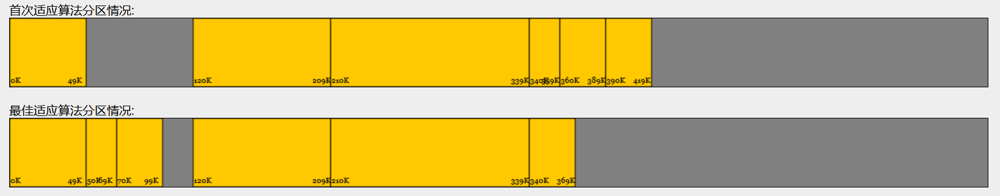
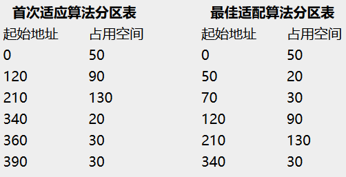
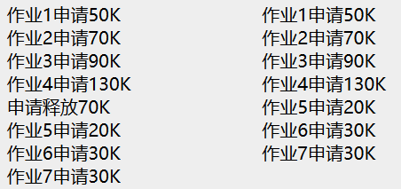
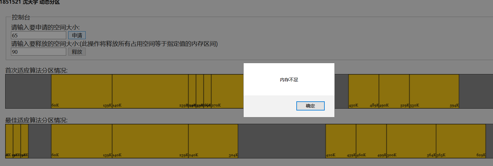
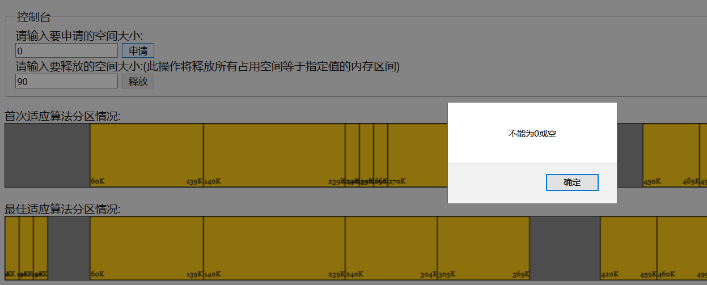
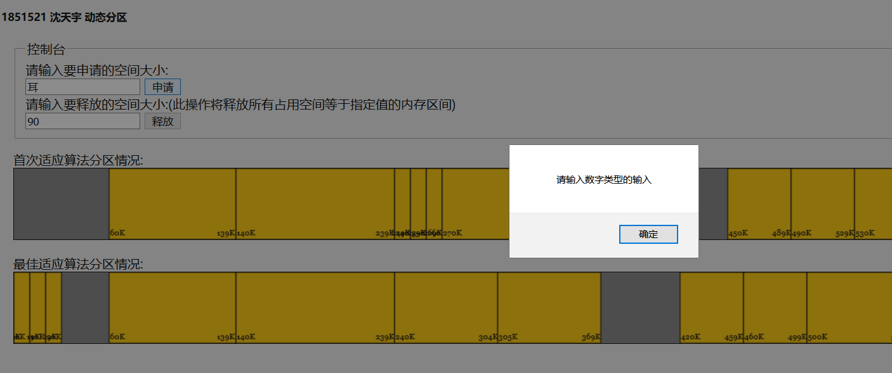
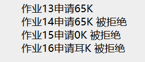
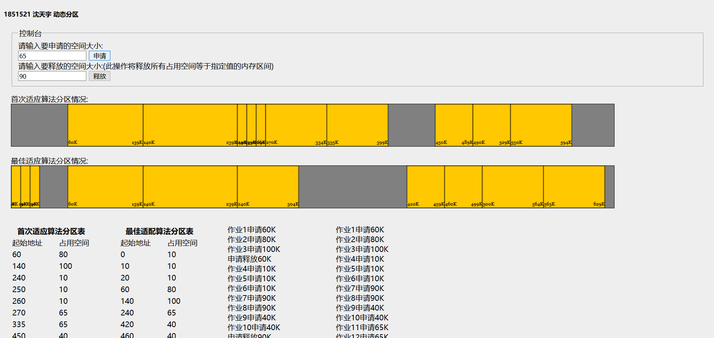
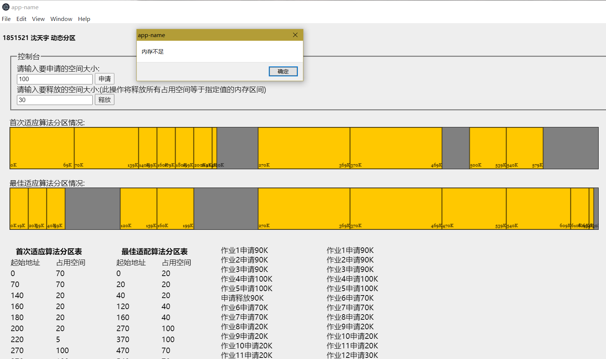

# 内存管理-动态分区

###### 操作系统第二次作业

### 1851521 沈天宇


## 项目介绍

**本项目已经托管在`github`上，项目地址**

**https://github.com/Ultrasty/memory-management**

### 1.背景

+ 内存管理——动态分区分配方式的模拟。 

+ 初始内存空间为 `640K`，分别利用首次适应算法和最佳适应算法进行内存块的分配和回收。

### 2.开发

+ 使用`javascript`进行开发。

### 3.运行
+ 使用浏览器运行`index.html`即可，已经在`Chrome`和`Firefox`上测试过，务必保证`index.html`、`js.js`、`css.css`在同一个文件夹下。
+ 也可以双击运行预编译的`app.exe`文件，但这个可执行文件有时会有bug，因此建议运行`index.html`。

## 实现的功能点

### 1.实现了自定义请求序列


### 2.同时显示两种分区方式的分区情况

同时显示两种分区方式的分区情况，能更清楚的比较两种分区方式的优点和缺点，可以方便的测试在特定的请求序列下何种分区方式会首先遇到内存不足的情况。



### 3.实现了通过首次适配算法对内存进行分区

### 4.实现了通过首次适配算法对内存进行分区

### 5.同时打印两种分区方式的分区表，便于对比



### 6.同时打印了两种分区方式的请求记录



### 7.内存不足时提醒



### 8.输入检查





### 9.错误日志



## 算法

过程式编程，采用一组全局变量表示分区情况。

变量的意义已在注释中声明。

### 1.首次适配算法

因为是循环最先适配，所以设置一个指针`$index`用来指示某次循环中`$index`指向的位置是分区表的哪一项，如果完成一整轮循环仍然无法找到合适的位置则弹窗提示“内存不足”。

```javascript
//最先适配算法的变量
var map = new Map(); //利用Map()新建一个分区表 key的值为起始地址 value的值为占用空间 地址空间从0-639
var $index = 0; //因为要用到循环查找，所以要记录当前位置
var arrayObj; //map对应的数组
var work = 1; //记录作业号
//循环首次适应算法
function firstAdaptationAlgorithm() {
    //打印log
    //如果拒绝某次请求，会打印"被拒绝"
    document.getElementById("work").innerHTML += "作业" + work + "申请" + document.getElementById("allocate").value + "K";
    work++;
    let start = $index;
    let space = Number(document.getElementById("allocate").value);
    //space不能为0
    if (space == 0) { //不能为0
        alert("不能为0或空");
        document.getElementById("work").innerHTML += " 被拒绝<br/>";
        return 0;
    }
    if (isNaN(space)) { //输入不能为非数字
        alert("请输入数字类型的输入");
        document.getElementById("work").innerHTML += " 被拒绝<br/>";
        return 0;
    }
    while (1) {

        //如果分区表全部空闲
        if (map.size == 0 && space <= maxSpace + 1) {
            map.set(0, space);
            update();
            document.getElementById("work").innerHTML += "<br/>";
            return 0;
        }

        //如果当前指针为0但分区表第一项不是从0开始
        if (map.size != 0 && $index == 0 && space <= arrayObj[0][0]) {
            map.set(0, space);
            update();
            document.getElementById("work").innerHTML += "<br/>";
            return 0;
        }

        //如果分区表当前指针走到的位置是分区表最后一位且仍有足够空闲空间
        if (map.size != 0 && $index == map.size - 1 && (arrayObj[$index][0] + arrayObj[$index][1] + space - 1) <= maxSpace) {
            map.set(arrayObj[$index][0] + arrayObj[$index][1], space);
            update();
            document.getElementById("work").innerHTML += "<br/>";
            return 0;
        }
        //如果分区表当前指针走到的位置不是分区表最后一位,且紧邻该分区存在空闲空间
        if (map.size != 0 && $index >= 0 && $index < map.size - 1 && (arrayObj[$index][0] + arrayObj[$index][1] + space - 1) <= arrayObj[$index + 1][0] - 1) {
            map.set(arrayObj[$index][0] + arrayObj[$index][1], space);
            update();
            document.getElementById("work").innerHTML += "<br/>";
            return 0;
        }

        //当前指针所指分区表项的下一个邻接区间没有空闲空间，所以将指针指向下一项
        $index = ($index + 1) % map.size;
        //如果循环了一轮依然没有找到空闲空间，则无法插入
        if ($index == start) {
            alert("内存不足");
            document.getElementById("work").innerHTML += " 被拒绝<br/>";
            return 0;
        }
    }
}
```


### 2.最优适配算法

遍历分区表的每一项，并记录最小的足够容纳所需空间的内存空闲区域的起始位置，然后将内存分配给此区域，并更新分区表。

```javascript
//最佳适配算法的变量
var map2 = new Map();
var arrayObj2;
var work2 = 1; //记录作业号
//最佳适应算法
function bestFitAlgorithm() {
    document.getElementById("work2").innerHTML += "作业" + work2 + "申请" + document.getElementById("allocate").value + "K";
    work2++;
    let space = Number(document.getElementById("allocate").value);
    if (space == 0) { //不能为0
        document.getElementById("work2").innerHTML += " 被拒绝<br/>";
        return 0;
    }
    if (isNaN(space)) { //输入不能为非数字
        document.getElementById("work2").innerHTML += " 被拒绝<br/>";
        return 0;
    }
    //如果分区表全部空闲
    if (map2.size == 0 && space <= maxSpace + 1) {
        map2.set(0, space);
        update();
        document.getElementById("work2").innerHTML += "<br/>";
        return 0;
    }
    let haveAlert = 0;
    let minSpace = 1000;
    let bestPlace;
    let index2 = 0;
    if (arrayObj2[0][0] >= space) {
        minSpace = arrayObj2[0][0];
        bestPlace = 0;
    }
    while (1) {
        if (index2 == map2.size - 1) {
            if ((arrayObj2[index2][0] + arrayObj2[index2][1] + space - 1) <= maxSpace &&
                maxSpace - arrayObj2[index2][0] - arrayObj2[index2][1] + 1 < minSpace) {
                minSpace = maxSpace - arrayObj2[index2][0] - arrayObj2[index2][1] + 1;
                bestPlace = arrayObj2[index2][0] + arrayObj2[index2][1];
            }
        }
        if (index2 < map2.size - 1) {
            if ((arrayObj2[index2][0] + arrayObj2[index2][1] + space - 1) <= arrayObj2[index2 + 1][0] - 1 &&
                arrayObj2[index2 + 1][0] - arrayObj2[index2][0] - arrayObj2[index2][1] < minSpace) {
                minSpace = arrayObj2[index2 + 1][0] - arrayObj2[index2][0] - arrayObj2[index2][1];
                bestPlace = arrayObj2[index2][0] + arrayObj2[index2][1];
            }
        }
        index2 = (index2 + 1) % map2.size;
        if (index2 == 0 && minSpace == 1000) {
            alert("内存不足");
            haveAlert = 1;
            document.getElementById("work2").innerHTML += " 被拒绝";
            break;
        } else if (index2 == 0) {
            break;
        }
    }
    if (haveAlert != 1) map2.set(bestPlace, space);
    document.getElementById("work2").innerHTML += "<br/>";
    update();
    return 0;
}
```


### 3.释放空间

```javascript
//释放空间
function $release() {
    let exist = false;
    for (let [key, value] of map) {
        if (value == Number(document.getElementById("release").value)) {
            exist = true;
            map.delete(key);
        }
    }
    //如果要删除的区间不存在则弹窗提示
    if (exist == false) {
        alert("区间大小为" + Number(document.getElementById("release").value) + "的区间不存在");
        document.getElementById("work").innerHTML += "申请释放" + Number(document.getElementById("release").value) + "K 但区间不存在<br/>";
    } else
        document.getElementById("work").innerHTML += "申请释放" + Number(document.getElementById("release").value) + "K<br/>";

    let exist2 = false;
    for (let [key, value] of map2) {
        if (value == Number(document.getElementById("release").value)) {
            exist2 = true;
            map2.delete(key);
        }
    }
    if (exist2 == false) {
        alert("区间大小为" + Number(document.getElementById("release").value) + "的区间不存在");
    }

    $sort();
    printTable();
}
```


## 运行演示

1.index.html



2.app.exe

